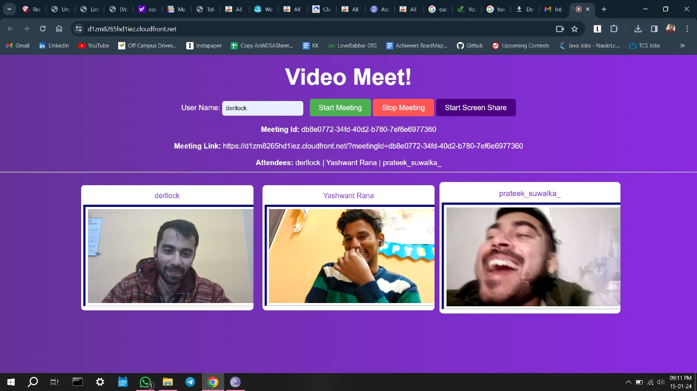

## Chech these out for better understanding
**https://github.com/architecturebytes/videoconf** 
**https://webrtc.ventures/2022/10/building-a-video-chat-with-the-amazon-chime-sdk/** 
**https://medium.com/trackit/deploy-your-own-video-call-application-using-amazon-chime-sdk-a260f6912760**

# AWS Chime VideoMeet - Setup Guide

## Backend (AWS Lambda)

1. **Install Dependencies:**
   - Login your AWS account
   - In AWS Lambda, the AWS SDK is pre-installed. No manual installation needed.

2. **Deploy Lambda:**
   - Upload `lambda/index.js` as your Lambda function code.
   - Set the handler to `index.handler`.

3. **Permissions:**
   - Attach an IAM role to your Lambda function with the following permissions:
     - `chime:CreateMeeting`
     - `chime:CreateAttendee`
     - `chime:GetMeeting`
     - `chime:DeleteAttendee`
     - `chime:DeleteMeeting`

4. **API Gateway:**
   - Create an API Gateway endpoint to trigger your Lambda function.
   - Enable CORS if the frontend is served from a different domain.

5. **Configuration:**
   - Make sure the Lambda is set to the correct region (default in code: `ap-southeast-2`).
   - Replace the "MEETING_SERVICE" with the required API Gateway endpoint and "region' in initialisation of chime in lambda/index.js

## Frontend (Web)

1. **Dependencies:**
   - Ensure the following files are present in `web/assets/`:
     - `css/vid.css`
     - `js/amazon-chime-sdk.min.js`
     - `js/vid.js`

2. **Serve the Frontend:**
   - Open a terminal in the `web` directory.
   - Start a static server:
     - Python: `python -m http.server`
     - Node: `npx serve .`
     - Or upload `web/` to a static web host (e.g., AWS S3, Netlify).

3. **Configure API Endpoint:**
   - In `vid.js`, ensure that API calls point to your deployed API Gateway endpoint that triggers the Lambda.

4. **Access the App:**
   - Open `http://localhost:8000` (or the URL provided by your static server) in your browser.

## Additional Notes

- You may want to secure your API Gateway endpoint.
- If deploying in a different AWS region, update the region in both the Lambda and frontend as needed.
- For testing, ensure your browser can access the backend API (check CORS and network settings).
